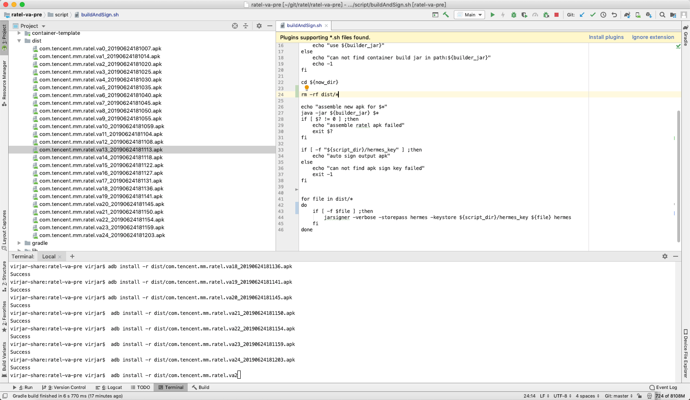
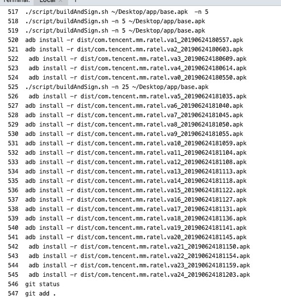

# RatelVa

# 论文实现

[VirtualApp技术黑产利用研究报告](https://www.freebuf.com/articles/paper/152091.html)

## 项目简介
RatelVa是基于virtualAPP实现一个一个单APK改包框架，他利用VA可以打开没有安装的apk的特性，实现对单一APK的二次封包。也就是使用VA作为虚拟化容器再运行另一个APP。这样的话，可以有如下功能

1. 病毒隐藏，项目灵感来源就是哪篇*VirtualApp技术黑产利用研究报告*,可以很容易把一个有毒的APK放置到这个容器里面，然后使用容器运行。这样可以很容易绕过杀毒软件查杀
2. 多开分身，和virtualApp本身的多开使用方式不一样的是。这种方案把va和app糅合在一起了，用户只需要下载一个apk。就可以支持多开了。更加适合普通人使用
3. apk包裹伪装，输出的apk，和原来的apk的的名字logo一样，普通用户可能无法区分。
4. 注入控制，和va一样。由于app运行在我们容器环境中，所以可以轻松控制他。

## 项目效果





## 使用方法

1. 代码环境，使用脚本处理apk
```
./script/buildAndSign.sh -n 25 ~/Desktop/app/base.apk
```
上述命令，将会带 ``dist``目录产生25个安装包，切app内容为``~/Desktop/app/base.apk ``
代码环境产生的包，将会自动签名

2. 生产环境，
```
java -jar script/container-builder-va-1.0.0.jar -n 25 ~/Desktop/app/base.apk
```
生产环境产生的apk，需要自行签名。不过生产环境不会进行源码构建动作。处理速度会快一些


## 声明

本项目使用了Lody大佬的VirtualApp源码，仅限研究学习使用。

## 引用

VirtualApp（va引擎）： https://github.com/asLody/VirtualApp

VirtualAppEx（va的一个扩展，支持Android9） :https://github.com/xxxyanchenxxx/VirtualAppEx
